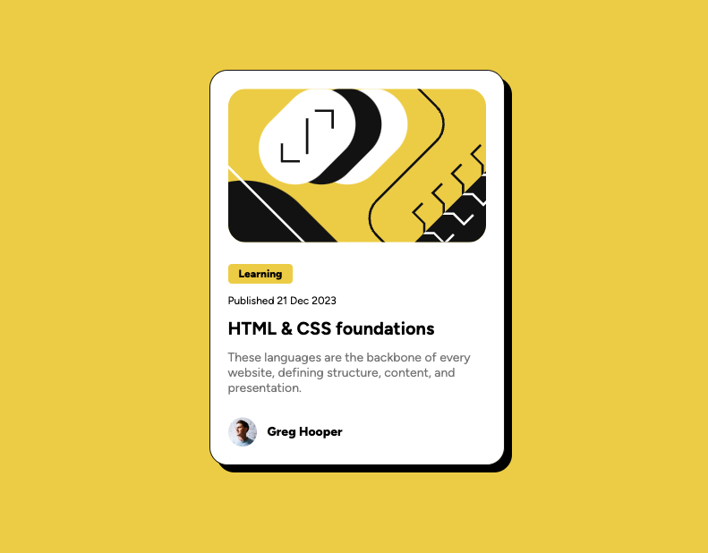

# Blog Preview Card (Frontend Mentor)

This is a solution to the [Blog preview card challenge on Frontend Mentor](https://www.frontendmentor.io/challenges/blog-preview-card-ckPaj01IcS). Frontend Mentor challenges help you improve your coding skills by building realistic projects.

## Overview

### The challenge

Users should be able to:

- See hover and focus states for all interactive elements on the page

## Screenshot

## Built with

- Semantic HTML5 markup
- CSS custom properties
- Flexbox
- Mobile-first workflow

## Author

- Website - [Jake Godsall](https://jakegodsall.com)
- Frontend Mentor - [@jakegodsall](https://www.frontendmentor.io/profile/jakegodsall)
- LinkedIn - [@godsalljake](https://www.linkedin.com/in/godsalljake/)

## License

This project is open source and available under the [MIT License](./LICENSE).
